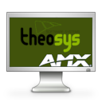
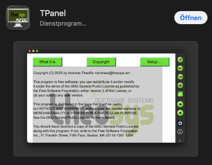

# TPanel

**TPanel** is an implementation of some AMX G4/G5 touch panels. The panels used
to verify the communication protocol and the behavior were an *AMX MVP-5200i* an
*AMX NXD-700Vi* and an *MST-701*.

**TPanel** was designed for *NIX desktops (Linux, BSD, …) as well as Android and
IOS operating systems. To create an executable for Android a special shell
script exists. It sets all dependencies and starts _cmake_ with all necessary
parameters.

> **Hint**: With version 1.4 of **TPanel** the support for Qt 5.x was canceled.
Now you must use Qt 6.x for all operating systems!

The software uses internally the [Skia](https://skia.org) library for drawing
all objects and the [Qt](https://doc.qt.io/) framework to display the objects
and handle widgets. **TPanel** is written in C++. This makes it especially on
mobile platforms fast and reliable. It has the advantage to not drain the
battery of any mobile device while running as fast as possible. Compared to
commercial products the battery lasts up to 10 times longer.

# Full documentation
Look at the full documentation in this repository. You'll find the
[reference manual](https://github.com/TheLord45/tpanel/tree/main/documentation) in two different formats:

* [PDF](https://github.com/TheLord45/tpanel/blob/main/documentation/ReferenceGuide.pdf)
* [ODT](https://github.com/TheLord45/tpanel/blob/main/documentation/ReferenceGuide.odt)

# Ready distribution downloads
For some operating systems I made packages which can be installed out of the box without compile.

## MacOS 26 or newer
Open the App Store and search for
[TPanel](https://apps.apple.com/at/app/tpanel/id6751942139?mt=12TPanel). It looks like:

Alternatively you can download it from my [download page](https://www.theosys.at/download)

## Android
Currently the app is available on my [download page](https://www.theosys.at/download) only.

However: I try to get it into the Google play store. Until I get at least 12 testers you can become
one and download it from Google PlayStore by clicking on this link:
* [https://play.google.com/apps/internaltest/4701740636736075296](https://play.google.com/apps/internaltest/4701740636736075296)

## Linux
The app is available on my [download page](https://www.theosys.at/download).

The package there is for Debian *Trixie*. 

## iOS - iPhone and iPad
I currently try to get it into the App Store. If you like to test it, write an email to `andreas @ theosys . at`
with the request to become a beta tester and your eMail address. I will add you to the beta testers and you'll
get an invitation by mail from Apple.

# How to compile
## Prerequisits
For Linux and MacOS you need the following libraries installed:

- [Qt 6](https://doc.qt.io/qt-6/)
- [Skia](https://skia.org)
- [pjsip](https://www.pjsip.org)
- openssl (part of your distribution)
- Expat (part of your distribution)
- Freetype (part of your distribution)

To install Qt I recommend to download the open source version from
[Open Source Development](https://www.qt.io/download-open-source).
However: Some Linux distributions are coming with Qt included. If you want to
use this version make sure, to install the Qt6 packages.

## Compile for Linux desktop
First [download the source](https://github.com/TheLord45/tpanel) into a
directory. Then enter the directory and type the following commands.

    $ cmake -B build -DCMAKE_PREFIX_PATH="/<path>/<to>/Qt/6.x.x/gcc_64/lib/cmake"
    $ cd build
    $ make
    $ sudo make install

> Replace `<path>/<to>/` with the path to your Qt installation (usualy `/opt/Qt`).

## Compile on MacOSX
First [download the source](https://github.com/TheLord45/tpanel) into a directory. Then enter the directory and type the following commands.

    $ cmake -B build -DCMAKE_PREFIX_PATH="/<path>/<to>/Qt/6.x.x/macos/lib/cmake:/<path>/<to>/homebrew/lib/cmake"
    $ cd build
    $ make

> Replace `<path>/<to>/` with the path to your Qt installation and to homebrew (usualy `$HOME/Qt`, `/opt/homebrew`).

You'll find the application in `build/tpanel.app/Contents/MacOS/tpanel`. Start it from the command line like:

    build/tpanel.app/Contents/MacOS/tpanel -c <configuration file>

If everything compiled successful and installed, you can start the application.
There is a setup dialog included. It depends on the operating system of how
it looks like.

## Compile for other operating systems

- [Compile for Android](documentation/build_android.md)
- [Compile for iOS](documentation/build_ios.md)
